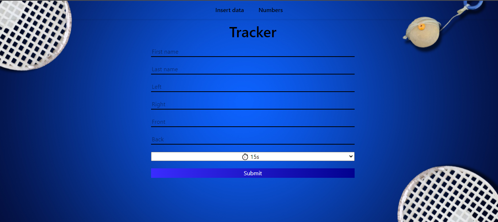

# **Speedball Logger**

Welcome to **Speedball Logger**! 🚀 This full-stack web application was meticulously designed and built to streamline the data entry process for our speedball team. Developed in response to the inefficiencies of manually collecting ball hit counts, this project saves our team valuable time and ensures accurate data management.

## **Table of Contents**
- [Introduction](#introduction)
- [Features](#features)
- [Tech Stack](#tech-stack)
- [Usage](#usage)
- [License](#license)
- [Screenshots](#screenshots)

## **Introduction**

**Speedball Logger** was created after a request from my speedball coach to enhance the efficiency of our data entry process. Previously, our coach would manually record ball hit counts, consuming around 60 hours a month. This website revolutionizes the process by allowing players to quickly enter their data, which is then stored and managed in a database. Now, data retrieval is at the coach’s fingertips anytime it's needed.

## **Features**

- **Efficient Data Entry**: Players can enter their ball hit counts in seconds.
- **Database Management**: Utilizes SQLite with indexes and views to optimize data storage and retrieval.
- **Login System**: New feature in version 2.0 to secure access.
- **Admin Panel**: Ongoing development to provide comprehensive management tools.
- **Improved UI**: Redesigned interface for a cleaner and more intuitive user experience.

## **Tech Stack**

- **Frontend**: HTML, CSS, JavaScript
- **Backend**: Node.js, Express
- **Database**: SQLite
- **Design**: Background created with Canva

## **Usage**

Once set up, players can log their ball hit counts through the website interface. Coaches can access the stored data anytime. The site is currently live [link placeholder] and available for use by my speedball team members. For access, please contact me.

## **License**

This project is open for use under the condition of prior approval. Please contact me before using it for any purposes outside of the speedball team.

## **Screenshots**

